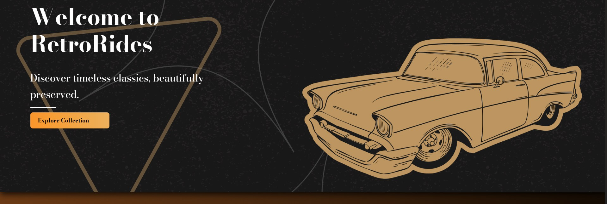
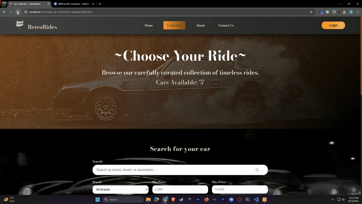
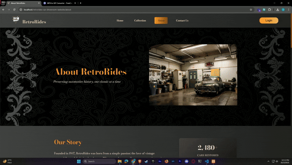
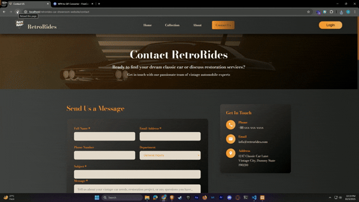
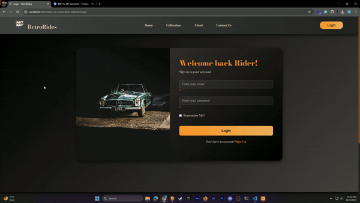
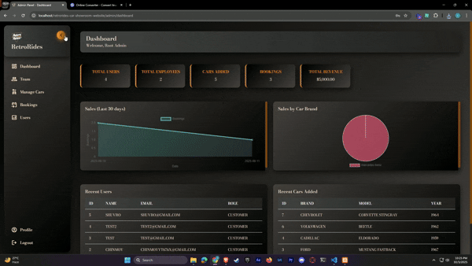

<h1 align="center"> 🚘 RetroRides - Vintage Automobile Management System </h1>

<p align="center">
   
   
   
</p>

<p align="center">
  
</p>

## 📖  Overview  
A comprehensive **web application** for managing vintage car collections, sales, and restoration services while offering customers a seamless way to explore, book, and connect.  
The Academic project is built with **PHP, MySQL, HTML, CSS, and JavaScript** using a custom **PHP MVC architecture** that's similar to Laravel.
Overall, it was a great learning experience.

---

## 🚗 Features

### 🌐 Public Features
-  **Landing Page** – Showcase featured classic cars and services.  
-  **Car Collection Browser** – Browse available vintage automobiles.  
-  **About Us** – Learn about the dealership’s history and team.  
-  **Contact Page** – Get in touch with the team.  

### 👥 User Management
-  **User Registration & Authentication**  
-  **Role-Based Access**: Customer, Sales, Admin  
-  **“Remember Me” Sessions** – Secure token-based authentication  
-  **Profile Management**  

### 🛡️ Admin Panel
-  **Dashboard** – Analytics & stats  
-  **User Management** – Activate/deactivate, roles  
-  **Team Management** – Full CRUD for employees  
-  **Car Inventory** – Full CRUD for cars  
-  **Booking Management**  
-  **Sales Tracking**  

### 🧑‍💼 Salesman
-  **TO-DO**  

### 🧑 Customer
-  **TO-DO**  

### 🔒 Security Features
-  **CSRF Protection**  
-  **Password hashing (bcrypt)**  
-  **Secure sessions** (HttpOnly, SameSite cookies)  
-  **Input validation & sanitization**  
-  **SQL injection prevention** with prepared statements  
-  **Role-based authorization**  

---


## ✨ Demo & Screenshots

### 🌐 Public Pages
| Landing Page |
|--------------|
 

| Car Collection | About Us |
|--------------|----------------|
|  |  |

| Contact Us | Authentication |
|------------|----------------|
|  |  |

### 🛡️ Admin Panel
| Admin Pages |
|--------------|



## 🛠️ Technology Stack
-  **Backend:** PHP  
-  **Database:** MySQL  
-  **Frontend:** HTML5, CSS3, Vanilla JS  
-  **Architecture:** Custom MVC + Dependency Injection  
-  **Security:** CSRF tokens, bcrypt, prepared statements  

---

## 📋 Requirements
-  PHP  
-  MySQL  
-  Apache/Nginx with `mod_rewrite` enabled  
-  Composer  
-  XAMPP 

## 🚀 Installation

```
# 1. Clone repo:
https://github.com/LT-Ripjaws/retrorides-car-showroom-website.git
cd retrorides

# 2. Install dependencies:
composer install

# 3. Configure database:
# Import retrorides_db in your xampp's MySQL server. (will be provided later)

# 4. Make sure xampp is configured:
#   In xammp/apache/conf/httpd.conf make sure <Directory "C:/xampp/htdocs"> has
#   AllowOverride All
#   Require all granted
```
---

### 🗄️ Database Schema
- 👥 **users** – Customer accounts  
- 🧑‍🤝‍🧑 **employees** – Staff members  
- 🚗 **cars** – Car inventory  
- 📅 **bookings** – Reservations  
- ❓ **inquiries** – Customer's inquiries  
- 🏷️ **offers** – Car offers and discounts  
- 🔑 **remember_me** – Persistent login tokens

### 🔮 Future Enhancements:
-  **ML-based price predictions**  
-  **Predictive analytics dashboard**  
-  **Salesman Module**  
-  **Customer Module**  

### 📝 License
This project is licensed under the MIT License

### 📊 Project Status
🚧 Active development – Version 1.0.0

## 👤 Author
*Chinmoy Guha*  

- GitHub: [@LT-Ripjaws](https://github.com/LT-Ripjaws)  
- Email: chinmoyguha676z@gmail.com
<p align="center">
  
</p>
<p align="center">  </p>
<p align="center">

</p>
